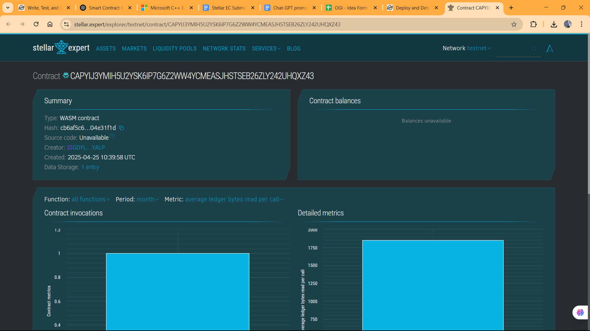

# Mental Health and Journaling App - Smart Contract

## 🧠 Project Title
**Mental Health and Journaling App**

## 📋 Project Description
This smart contract is part of a decentralized journaling and mental wellness platform. It allows users to privately store, retrieve, and manage personal journal entries on-chain using the Soroban smart contract SDK.

## 🌟 Project Vision
To empower individuals with a secure, private, and decentralized digital space where they can track emotions, mental health progress, and express their thoughts safely without fear of data misuse or privacy breach.

## 🚀 Key Features
- **Private Journal Entries**: Every user has their own encrypted journal storage.
- **Time-stamped Entries**: Automatically records when each journal entry is made.
- **Retrieval System**: Easily fetch previous journal entries.
- **Entry Analytics**: Keeps a count of how many entries a user has logged.

## 🔮 Future Scope
- Integration with **mood tracking** and **sentiment analysis AI models**.
- Support for **NFT-based mental wellness badges**.
- Enable **anonymous community sharing** of journal entries.
- Build a **mobile-friendly DApp interface** using Flutter and IPFS for decentralized file storage.
- Add **end-to-end encryption** for off-chain storage with smart contract index pointers.

---

> Built using Soroban SDK, this contract supports mental wellness by encouraging safe and consistent journaling in a decentralized environment.

## Contract Details
GAUXHI563KQ4IODIFH25S4XIKRWJEHKD6HE4LTGGSNXQE4WF33WQ45JW

